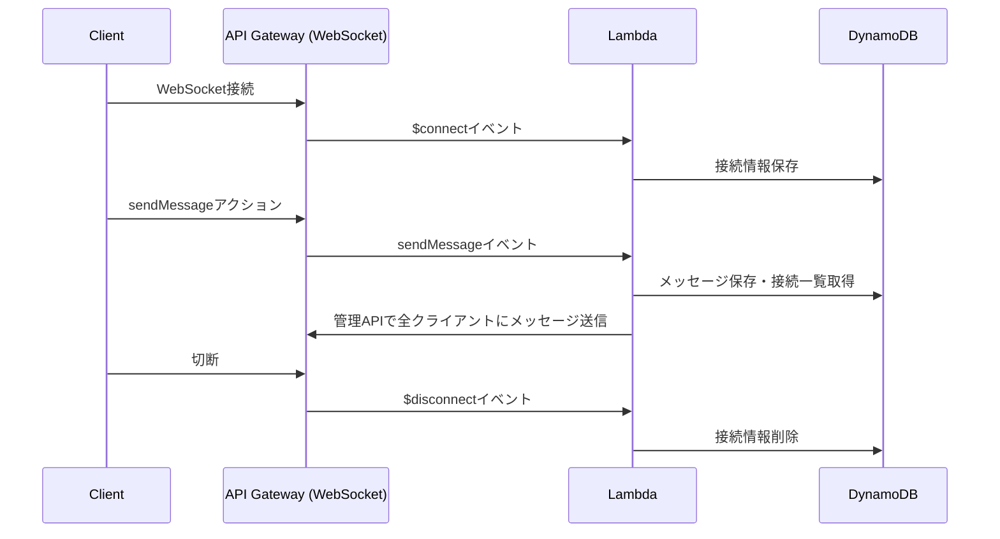

# AWSでサーバーレスWebSocketチャットを構築する構成例

## 構成概要

- **API Gateway WebSocket API**  
  クライアントからのWebSocket接続を受け付け、各種イベント（接続/切断/メッセージ送信）をLambdaにルーティングする。

- **AWS Lambda**  
  各イベント（$connect, $disconnect, sendMessage など）ごとにLambda関数を用意し、接続管理やメッセージの保存・配信を行う。

- **DynamoDB**  
  接続中クライアント情報やチャットメッセージ履歴を保存する。

## 典型的なフロー

1. **クライアントがWebSocketでAPI Gatewayに接続**  
   - $connectイベントが発生し、Lambda（例: connectHandler）が呼ばれる。
   - LambdaはDynamoDBに接続情報（ConnectionIdなど）を保存。

2. **クライアントがメッセージ送信**  
   - sendMessageアクションでAPI Gatewayにメッセージを送信。
   - Lambda（例: messageHandler）が呼ばれ、DynamoDBにメッセージを保存し、全接続者のConnectionIdを取得。
   - API Gatewayの管理API（管理用WebSocket API）を使い、全クライアントにメッセージを送信。

3. **クライアント切断**  
   - $disconnectイベントでLambda（例: disconnectHandler）が呼ばれ、DynamoDBから接続情報を削除。

## 構成図（Mermaid）

## 参考リソース

- [AWS公式: WebSocket API in API Gateway](https://docs.aws.amazon.com/ja_jp/apigateway/latest/developerguide/apigateway-websocket-api.html)
- [AWS公式: サーバーレスWebSocketチャットのサンプル](https://github.com/aws-samples/simple-websockets-chat-app)

## 備考

- Lambdaは常時接続を維持しないため、API Gatewayが接続管理を担う。
- DynamoDBはメモリの代わりに永続的なストレージとして利用可能。
- チャット履歴の取得や過去メッセージの配信もLambda+DynamoDBで実装可能。
